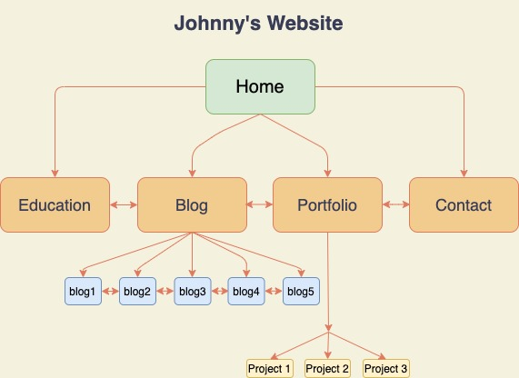
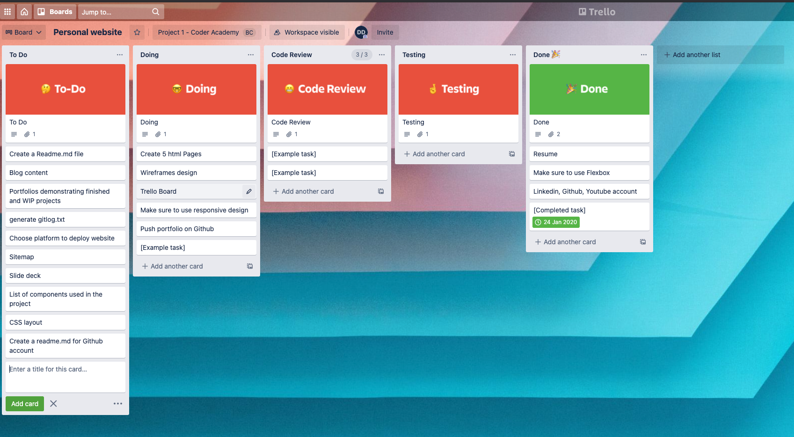
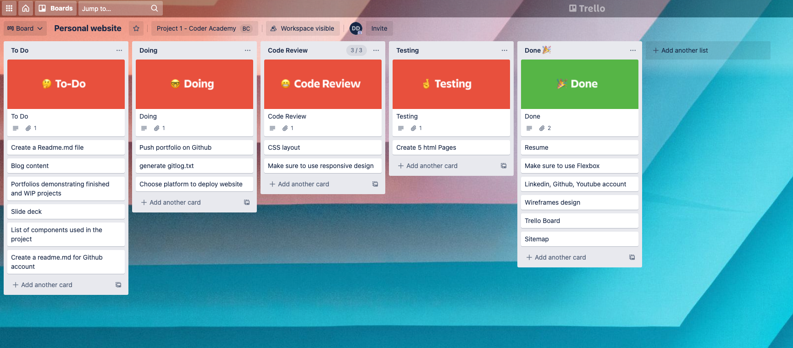
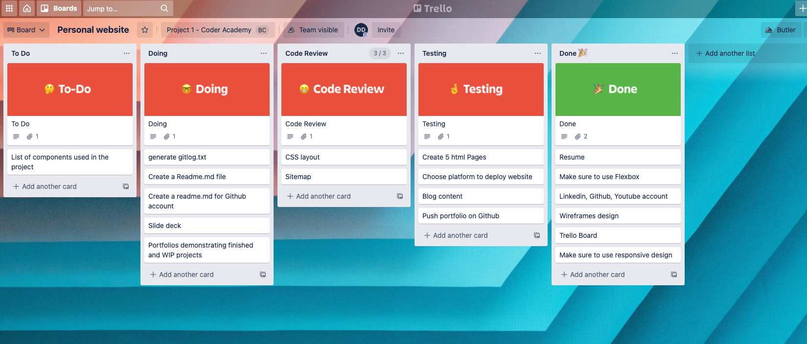
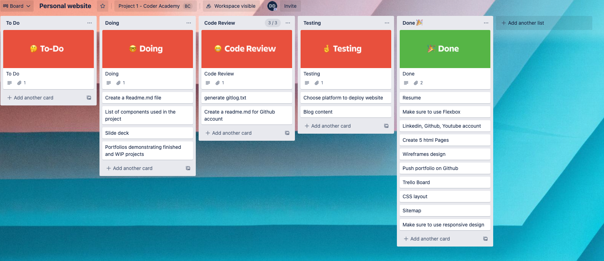
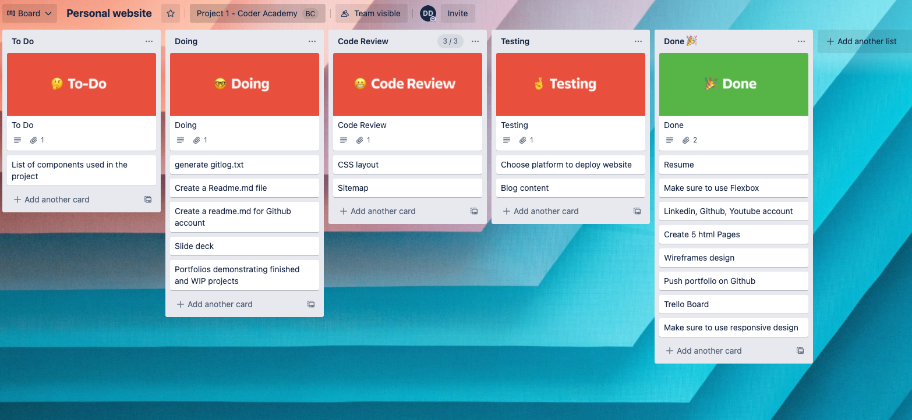
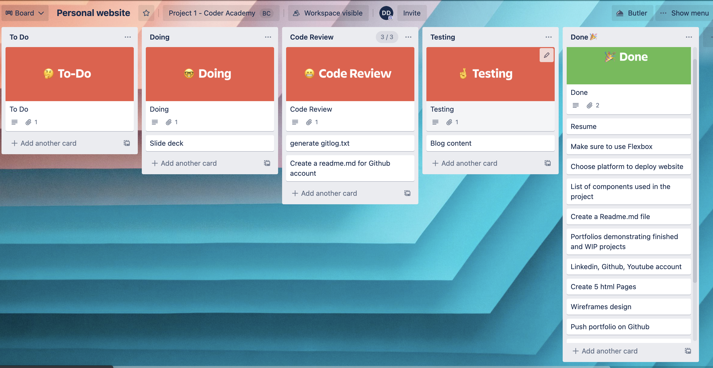

# Johnny's portfolio-site
# URL link 
https://johnny-personal-website.netlify.app/index.html

# Github link
https://github.com/Johnny-coderacademy/portfolio-site

# Description 
  - Purpose: A brief introduction about myself, my personal interests and projects I have finished recently. Also, it is a platform for me to contact and interact with others. 

  - Functionality / features:
   1. Navbar for viewers to navigate across all pages
   2. Flex box & animation
   3. Media queries for responsive design for viewing on multiple devices
   4. Hover and image transformation
   5. Form and text inputs
   6. Flip animation on porfolio page
   7. Links to professional websites
 

  - Sitemap 
	

# Screenshots 

## Home page

## Education page

## Blog page

## Portfolio-front page

## Portfolio-back page

## Contact

# Target Audience

1. Potential employers
2. Colleagues & friends
3. Other developers

# Tech stack

1. Html_5 & Css_3
2. Draw.io - for creating sitemap
3. Netify.com - for hosting
4. Canva.com - for creating logo and resizing images
5. Git
6. Github
7. Font-awsome
8. Google font
9. YouTube
10. Stackoverflow.com

# Trello board
## Day 1

## Day 2

## Day 3

## Day 4

## Day 5

## Day 6

# Trello board link
https://trello.com/b/TQDBtves/personal-website